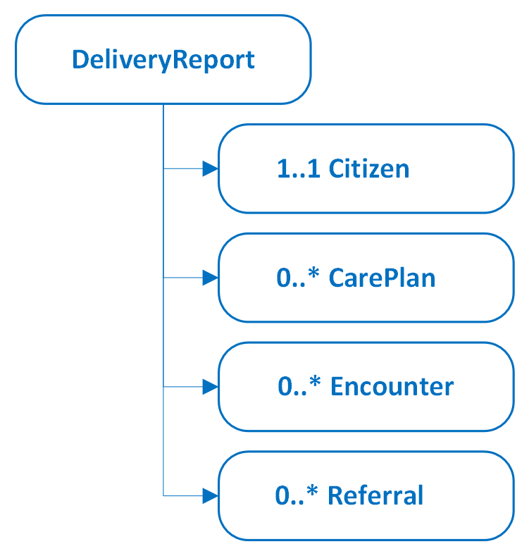
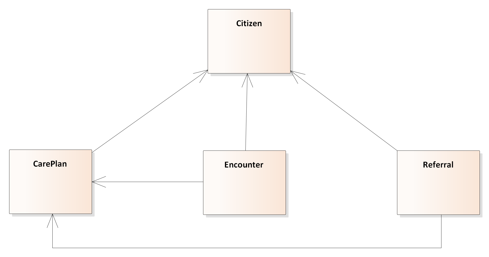

# Home - LTT Implementation Guide v1.0.1

* [**Table of Contents**](toc.md)
* **Home**

## Home

| | |
| :--- | :--- |
| *Official URL*:http://fhir.kl.dk/ltt/ImplementationGuide/kl.dk.fhir.ltt | *Version*:1.0.1 |
| Active as of 2025-10-29 | *Computable Name*:LTT |

# LTT - KL Lettilgængeligt tilbud

This implementation guide describes the delivery of LTT data to KL Gateway. The data originates from the documentation on the activity in LTT in the Danish municipalities. The reporting aims for compliance with the Danish core profiles.

The profiles for the reporting are restricted to allow only the information that is required to report to KL Gateway.

## Overview

The data is reported as a collection of instances. A report contain instances that conforms to the profiles defined in this implementation guide. See figure below.



In addition to being structured as a report, relationships exist between the profiles. These are illustrated in the UML Class Diagram in the figure below.



The Class diagram shows that CarePlan, Encounter and Referral are all associated with Citizen i.e. these profiles know which Citizen they hold information about. The Encounter and Referral are also associated with the CarePlan.

The Citizen profile inherit from dk-core, even though it is not illustrated specifically in the Class Diagram.

## Special constraints, and resulting reporting practises

Whereas the report may seem unconstrained, each profile define constraints on attributes, datatypes and cardinalities. See descriptions below.

## Citizen

Information about the citizens that are the subjects of the report. This resource is used to get a reference to the child or youth.

##### Attributes

* civil registration number (CPR-nr).
* identification of the municipality holding and reporting the data.
* a FHIR status attribute used to report errors.

##### Validation

* One and only one civil registration number exists, and is a syntactically valid CPR-nr.
* One and only one managing organization exists, and is a syntactically valid SOR code (only code length is currently validated in the profile, but the authorization validates the actual SOR code).
* One FHIR status may exist, and should be selected from the standard ValueSet.

## CarePlan

This model contains information about the treatment pathway from the child’s or youths first encounter with the municipality concerning LTT.

##### Attributes

* A start time.
* An end time.
* A code that decribes which care plan it is.
* A reference to the Citizen instance that holds the child or youth's information.
* A reasonCode that describe the focus area which is the reason for the care plan and encounters.
* Three FHIR status attributes (status, intent, activity.detail.status).

##### Validation

* One and only one code exists and should be selected from a specific ValueSet.
* One and only one start time.
* One and only one reference to the Citizen exists.
* The reasonCode is optional. If present, it should be selected from a specific ValueSet. It is allowed to have more than one reasonCode.
* The FHIR status attributes are mandatory, and should be selected from the standard FHIR ValueSet.

## Encounter

Information about when a child or youth have an encounter such as screenings, prelimerary interviews, treatments, etc. in a Danish municipality context.

##### Attributes

* Type of encounter. The attribute describe which encounter is delivered using a code.
* Encounter class. The attribute holds a code which describe the place of delivery.
* The encounter start time.
* A reference to the Citizen instance that holds the child or youth's information.
* A FHIR status attribute.
* The participant of the encounter. It can be the child or youth itself or its parents.
* A delivery type code that express whether the encounter is delivered in a group or individually.
* A reference to the CarePlan instance the Encounter is a part of.

##### Validation

* One and only one encounter type exists, and should be selected from a specific ValueSet, no other codes may be reported.
* One and only one encounter class exists, and should be selected from a specific ValueSet.
* One and only one encounter start time exists.
* One and only one reference to the Citizen exists.
* One and only one reference to the CarePlan exists.
* One and only one FHIR status exists, and should be selected from the standard FHIR ValueSet.
* One delivery type code, which should be selected from a specific ValueSet, may exist.
* One participant code, which should be selected from a specific ValueSet, may exist.

## Referral

Referrals in this context are informal recommendations to other parties, such as the child’s or youth’s general practitioner, a §126a service in another municipality, and similar instances.

##### Attributes

* A code indicating which service the citizen is being referred to.
* A start time.
* A reference to the Citizen instance that holds the child or youth's information.
* A reference to the CarePlan instance that this referral is a part of.
* Three FHIR status attributes (status, intent, activity.detail.status).

##### Validation

* One and only one code is mandatory and should be selected from the specified ValueSet.
* One and only one start time.
* One and only one reference to the Citizen exists.
* One and only one reference to the CarePlan exists.
* The FHIR status attributes are mandatory, and should be selected from the standard FHIR ValueSet. activity.detail.status must be set to 'completed'.

## Dependencies


## Cross Version Analysis

This is an R4 IG. None of the features it uses are changed in R4B, so it can be used as is with R4B systems. Packages for both [R4 (kl.dk.fhir.ltt.r4)](package.r4.tgz) and [R4B (kl.dk.fhir.ltt.r4b)](package.r4b.tgz) are available.

## Global Profiles

*There are no Global profiles defined*

## IP Statements

This publication includes IP covered under the following statements.

* This material derives from the HL7 Terminology (THO). THO is copyright ©1989+ Health Level Seven International and is made available under the CC0 designation. For more licensing information see: [https://terminology.hl7.org/license.html](https://terminology.hl7.org/license.html)

* [ActCode](http://terminology.hl7.org/6.5.0/CodeSystem-v3-ActCode.html): [Bundle/DeliveryReport-Josefine-1](Bundle-DeliveryReport-Josefine-1.md), [Bundle/DeliveryReport-Josefine-2](Bundle-DeliveryReport-Josefine-2.md)...Show 9 more,[Bundle/DeliveryReport-Josefine-3](Bundle-DeliveryReport-Josefine-3.md),[Bundle/DeliveryReport-Josefine-4](Bundle-DeliveryReport-Josefine-4.md),[Bundle/DeliveryReport-Josefine-5-6-7](Bundle-DeliveryReport-Josefine-5-6-7.md),[Bundle/DeliveryReport-Josefine-8](Bundle-DeliveryReport-Josefine-8.md),[Bundle/DeliveryReport-Josefine-9](Bundle-DeliveryReport-Josefine-9.md),[Bundle/RapportOmJosefine](Bundle-RapportOmJosefine.md),[Bundle/TestIncrementalDelivery](Bundle-TestIncrementalDelivery.md),[Encounter/Behandlingskontakt](Encounter-Behandlingskontakt.md)and[KLGatewayLTTEncounter](StructureDefinition-klgateway-ltt-encounter.md)


## Resource Content

```json
{
  "resourceType" : "ImplementationGuide",
  "id" : "kl.dk.fhir.ltt",
  "url" : "http://fhir.kl.dk/ltt/ImplementationGuide/kl.dk.fhir.ltt",
  "version" : "1.0.1",
  "name" : "LTT",
  "title" : "LTT Implementation Guide",
  "status" : "active",
  "date" : "2025-10-29T22:49:04+01:00",
  "publisher" : "Kommunernes Landsforening",
  "contact" : [
    {
      "name" : "Kommunernes Landsforening",
      "telecom" : [
        {
          "system" : "url",
          "value" : "http://kl.dk"
        }
      ]
    }
  ],
  "description" : "LTT provides the specification for reporting selected data on the use of easily accessible services (lettilgængelige tilbud) offered by municipalities for children and youth experiencing mental distress (SUL §126a). Data is reported to FK Gateway",
  "packageId" : "kl.dk.fhir.ltt",
  "license" : "CC0-1.0",
  "fhirVersion" : ["4.0.1"],
  "dependsOn" : [
    {
      "id" : "hl7tx",
      "extension" : [
        {
          "url" : "http://hl7.org/fhir/tools/StructureDefinition/implementationguide-dependency-comment",
          "valueMarkdown" : "Automatically added as a dependency - all IGs depend on HL7 Terminology"
        }
      ],
      "uri" : "http://terminology.hl7.org/ImplementationGuide/hl7.terminology",
      "packageId" : "hl7.terminology.r4",
      "version" : "6.5.0"
    },
    {
      "id" : "hl7ext",
      "extension" : [
        {
          "url" : "http://hl7.org/fhir/tools/StructureDefinition/implementationguide-dependency-comment",
          "valueMarkdown" : "Automatically added as a dependency - all IGs depend on the HL7 Extension Pack"
        }
      ],
      "uri" : "http://hl7.org/fhir/extensions/ImplementationGuide/hl7.fhir.uv.extensions",
      "packageId" : "hl7.fhir.uv.extensions.r4",
      "version" : "5.2.0"
    },
    {
      "id" : "hl7_fhir_dk_core",
      "uri" : "http://hl7.dk/fhir/core/ImplementationGuide/hl7.fhir.dk.core",
      "packageId" : "hl7.fhir.dk.core",
      "version" : "3.4.0"
    },
    {
      "id" : "kl_dk_fhir_term",
      "uri" : "http://fhir.kl.dk/term/ImplementationGuide/kl.dk.fhir.term",
      "packageId" : "kl.dk.fhir.term",
      "version" : "2.3.0"
    }
  ],
  "definition" : {
    "extension" : [
      {
        "extension" : [
          {
            "url" : "code",
            "valueString" : "copyrightyear"
          },
          {
            "url" : "value",
            "valueString" : "2025+"
          }
        ],
        "url" : "http://hl7.org/fhir/tools/StructureDefinition/ig-parameter"
      },
      {
        "extension" : [
          {
            "url" : "code",
            "valueString" : "releaselabel"
          },
          {
            "url" : "value",
            "valueString" : "ci-build"
          }
        ],
        "url" : "http://hl7.org/fhir/tools/StructureDefinition/ig-parameter"
      },
      {
        "extension" : [
          {
            "url" : "code",
            "valueString" : "autoload-resources"
          },
          {
            "url" : "value",
            "valueString" : "true"
          }
        ],
        "url" : "http://hl7.org/fhir/tools/StructureDefinition/ig-parameter"
      },
      {
        "extension" : [
          {
            "url" : "code",
            "valueString" : "path-liquid"
          },
          {
            "url" : "value",
            "valueString" : "template/liquid"
          }
        ],
        "url" : "http://hl7.org/fhir/tools/StructureDefinition/ig-parameter"
      },
      {
        "extension" : [
          {
            "url" : "code",
            "valueString" : "path-liquid"
          },
          {
            "url" : "value",
            "valueString" : "input/liquid"
          }
        ],
        "url" : "http://hl7.org/fhir/tools/StructureDefinition/ig-parameter"
      },
      {
        "extension" : [
          {
            "url" : "code",
            "valueString" : "path-qa"
          },
          {
            "url" : "value",
            "valueString" : "temp/qa"
          }
        ],
        "url" : "http://hl7.org/fhir/tools/StructureDefinition/ig-parameter"
      },
      {
        "extension" : [
          {
            "url" : "code",
            "valueString" : "path-temp"
          },
          {
            "url" : "value",
            "valueString" : "temp/pages"
          }
        ],
        "url" : "http://hl7.org/fhir/tools/StructureDefinition/ig-parameter"
      },
      {
        "extension" : [
          {
            "url" : "code",
            "valueString" : "path-output"
          },
          {
            "url" : "value",
            "valueString" : "output"
          }
        ],
        "url" : "http://hl7.org/fhir/tools/StructureDefinition/ig-parameter"
      },
      {
        "extension" : [
          {
            "url" : "code",
            "valueString" : "path-suppressed-warnings"
          },
          {
            "url" : "value",
            "valueString" : "input/ignoreWarnings.txt"
          }
        ],
        "url" : "http://hl7.org/fhir/tools/StructureDefinition/ig-parameter"
      },
      {
        "extension" : [
          {
            "url" : "code",
            "valueString" : "path-history"
          },
          {
            "url" : "value",
            "valueString" : "http://fhir.kl.dk/ltt/history.html"
          }
        ],
        "url" : "http://hl7.org/fhir/tools/StructureDefinition/ig-parameter"
      },
      {
        "extension" : [
          {
            "url" : "code",
            "valueString" : "template-html"
          },
          {
            "url" : "value",
            "valueString" : "template-page.html"
          }
        ],
        "url" : "http://hl7.org/fhir/tools/StructureDefinition/ig-parameter"
      },
      {
        "extension" : [
          {
            "url" : "code",
            "valueString" : "template-md"
          },
          {
            "url" : "value",
            "valueString" : "template-page-md.html"
          }
        ],
        "url" : "http://hl7.org/fhir/tools/StructureDefinition/ig-parameter"
      },
      {
        "extension" : [
          {
            "url" : "code",
            "valueString" : "apply-contact"
          },
          {
            "url" : "value",
            "valueString" : "true"
          }
        ],
        "url" : "http://hl7.org/fhir/tools/StructureDefinition/ig-parameter"
      },
      {
        "extension" : [
          {
            "url" : "code",
            "valueString" : "apply-context"
          },
          {
            "url" : "value",
            "valueString" : "true"
          }
        ],
        "url" : "http://hl7.org/fhir/tools/StructureDefinition/ig-parameter"
      },
      {
        "extension" : [
          {
            "url" : "code",
            "valueString" : "apply-copyright"
          },
          {
            "url" : "value",
            "valueString" : "true"
          }
        ],
        "url" : "http://hl7.org/fhir/tools/StructureDefinition/ig-parameter"
      },
      {
        "extension" : [
          {
            "url" : "code",
            "valueString" : "apply-jurisdiction"
          },
          {
            "url" : "value",
            "valueString" : "true"
          }
        ],
        "url" : "http://hl7.org/fhir/tools/StructureDefinition/ig-parameter"
      },
      {
        "extension" : [
          {
            "url" : "code",
            "valueString" : "apply-license"
          },
          {
            "url" : "value",
            "valueString" : "true"
          }
        ],
        "url" : "http://hl7.org/fhir/tools/StructureDefinition/ig-parameter"
      },
      {
        "extension" : [
          {
            "url" : "code",
            "valueString" : "apply-publisher"
          },
          {
            "url" : "value",
            "valueString" : "true"
          }
        ],
        "url" : "http://hl7.org/fhir/tools/StructureDefinition/ig-parameter"
      },
      {
        "extension" : [
          {
            "url" : "code",
            "valueString" : "apply-version"
          },
          {
            "url" : "value",
            "valueString" : "true"
          }
        ],
        "url" : "http://hl7.org/fhir/tools/StructureDefinition/ig-parameter"
      },
      {
        "extension" : [
          {
            "url" : "code",
            "valueString" : "apply-wg"
          },
          {
            "url" : "value",
            "valueString" : "true"
          }
        ],
        "url" : "http://hl7.org/fhir/tools/StructureDefinition/ig-parameter"
      },
      {
        "extension" : [
          {
            "url" : "code",
            "valueString" : "active-tables"
          },
          {
            "url" : "value",
            "valueString" : "true"
          }
        ],
        "url" : "http://hl7.org/fhir/tools/StructureDefinition/ig-parameter"
      },
      {
        "extension" : [
          {
            "url" : "code",
            "valueString" : "fmm-definition"
          },
          {
            "url" : "value",
            "valueString" : "http://hl7.org/fhir/versions.html#maturity"
          }
        ],
        "url" : "http://hl7.org/fhir/tools/StructureDefinition/ig-parameter"
      },
      {
        "extension" : [
          {
            "url" : "code",
            "valueString" : "propagate-status"
          },
          {
            "url" : "value",
            "valueString" : "true"
          }
        ],
        "url" : "http://hl7.org/fhir/tools/StructureDefinition/ig-parameter"
      },
      {
        "extension" : [
          {
            "url" : "code",
            "valueString" : "excludelogbinaryformat"
          },
          {
            "url" : "value",
            "valueString" : "true"
          }
        ],
        "url" : "http://hl7.org/fhir/tools/StructureDefinition/ig-parameter"
      },
      {
        "extension" : [
          {
            "url" : "code",
            "valueString" : "tabbed-snapshots"
          },
          {
            "url" : "value",
            "valueString" : "true"
          }
        ],
        "url" : "http://hl7.org/fhir/tools/StructureDefinition/ig-parameter"
      },
      {
        "url" : "http://hl7.org/fhir/tools/StructureDefinition/ig-internal-dependency",
        "valueCode" : "hl7.fhir.uv.tools.r4#0.8.0"
      },
      {
        "extension" : [
          {
            "url" : "code",
            "valueCode" : "copyrightyear"
          },
          {
            "url" : "value",
            "valueString" : "2025+"
          }
        ],
        "url" : "http://hl7.org/fhir/tools/StructureDefinition/ig-parameter"
      },
      {
        "extension" : [
          {
            "url" : "code",
            "valueCode" : "releaselabel"
          },
          {
            "url" : "value",
            "valueString" : "ci-build"
          }
        ],
        "url" : "http://hl7.org/fhir/tools/StructureDefinition/ig-parameter"
      },
      {
        "extension" : [
          {
            "url" : "code",
            "valueCode" : "autoload-resources"
          },
          {
            "url" : "value",
            "valueString" : "true"
          }
        ],
        "url" : "http://hl7.org/fhir/tools/StructureDefinition/ig-parameter"
      },
      {
        "extension" : [
          {
            "url" : "code",
            "valueCode" : "path-liquid"
          },
          {
            "url" : "value",
            "valueString" : "template/liquid"
          }
        ],
        "url" : "http://hl7.org/fhir/tools/StructureDefinition/ig-parameter"
      },
      {
        "extension" : [
          {
            "url" : "code",
            "valueCode" : "path-liquid"
          },
          {
            "url" : "value",
            "valueString" : "input/liquid"
          }
        ],
        "url" : "http://hl7.org/fhir/tools/StructureDefinition/ig-parameter"
      },
      {
        "extension" : [
          {
            "url" : "code",
            "valueCode" : "path-qa"
          },
          {
            "url" : "value",
            "valueString" : "temp/qa"
          }
        ],
        "url" : "http://hl7.org/fhir/tools/StructureDefinition/ig-parameter"
      },
      {
        "extension" : [
          {
            "url" : "code",
            "valueCode" : "path-temp"
          },
          {
            "url" : "value",
            "valueString" : "temp/pages"
          }
        ],
        "url" : "http://hl7.org/fhir/tools/StructureDefinition/ig-parameter"
      },
      {
        "extension" : [
          {
            "url" : "code",
            "valueCode" : "path-output"
          },
          {
            "url" : "value",
            "valueString" : "output"
          }
        ],
        "url" : "http://hl7.org/fhir/tools/StructureDefinition/ig-parameter"
      },
      {
        "extension" : [
          {
            "url" : "code",
            "valueCode" : "path-suppressed-warnings"
          },
          {
            "url" : "value",
            "valueString" : "input/ignoreWarnings.txt"
          }
        ],
        "url" : "http://hl7.org/fhir/tools/StructureDefinition/ig-parameter"
      },
      {
        "extension" : [
          {
            "url" : "code",
            "valueCode" : "path-history"
          },
          {
            "url" : "value",
            "valueString" : "http://fhir.kl.dk/ltt/history.html"
          }
        ],
        "url" : "http://hl7.org/fhir/tools/StructureDefinition/ig-parameter"
      },
      {
        "extension" : [
          {
            "url" : "code",
            "valueCode" : "template-html"
          },
          {
            "url" : "value",
            "valueString" : "template-page.html"
          }
        ],
        "url" : "http://hl7.org/fhir/tools/StructureDefinition/ig-parameter"
      },
      {
        "extension" : [
          {
            "url" : "code",
            "valueCode" : "template-md"
          },
          {
            "url" : "value",
            "valueString" : "template-page-md.html"
          }
        ],
        "url" : "http://hl7.org/fhir/tools/StructureDefinition/ig-parameter"
      },
      {
        "extension" : [
          {
            "url" : "code",
            "valueCode" : "apply-contact"
          },
          {
            "url" : "value",
            "valueString" : "true"
          }
        ],
        "url" : "http://hl7.org/fhir/tools/StructureDefinition/ig-parameter"
      },
      {
        "extension" : [
          {
            "url" : "code",
            "valueCode" : "apply-context"
          },
          {
            "url" : "value",
            "valueString" : "true"
          }
        ],
        "url" : "http://hl7.org/fhir/tools/StructureDefinition/ig-parameter"
      },
      {
        "extension" : [
          {
            "url" : "code",
            "valueCode" : "apply-copyright"
          },
          {
            "url" : "value",
            "valueString" : "true"
          }
        ],
        "url" : "http://hl7.org/fhir/tools/StructureDefinition/ig-parameter"
      },
      {
        "extension" : [
          {
            "url" : "code",
            "valueCode" : "apply-jurisdiction"
          },
          {
            "url" : "value",
            "valueString" : "true"
          }
        ],
        "url" : "http://hl7.org/fhir/tools/StructureDefinition/ig-parameter"
      },
      {
        "extension" : [
          {
            "url" : "code",
            "valueCode" : "apply-license"
          },
          {
            "url" : "value",
            "valueString" : "true"
          }
        ],
        "url" : "http://hl7.org/fhir/tools/StructureDefinition/ig-parameter"
      },
      {
        "extension" : [
          {
            "url" : "code",
            "valueCode" : "apply-publisher"
          },
          {
            "url" : "value",
            "valueString" : "true"
          }
        ],
        "url" : "http://hl7.org/fhir/tools/StructureDefinition/ig-parameter"
      },
      {
        "extension" : [
          {
            "url" : "code",
            "valueCode" : "apply-version"
          },
          {
            "url" : "value",
            "valueString" : "true"
          }
        ],
        "url" : "http://hl7.org/fhir/tools/StructureDefinition/ig-parameter"
      },
      {
        "extension" : [
          {
            "url" : "code",
            "valueCode" : "apply-wg"
          },
          {
            "url" : "value",
            "valueString" : "true"
          }
        ],
        "url" : "http://hl7.org/fhir/tools/StructureDefinition/ig-parameter"
      },
      {
        "extension" : [
          {
            "url" : "code",
            "valueCode" : "active-tables"
          },
          {
            "url" : "value",
            "valueString" : "true"
          }
        ],
        "url" : "http://hl7.org/fhir/tools/StructureDefinition/ig-parameter"
      },
      {
        "extension" : [
          {
            "url" : "code",
            "valueCode" : "fmm-definition"
          },
          {
            "url" : "value",
            "valueString" : "http://hl7.org/fhir/versions.html#maturity"
          }
        ],
        "url" : "http://hl7.org/fhir/tools/StructureDefinition/ig-parameter"
      },
      {
        "extension" : [
          {
            "url" : "code",
            "valueCode" : "propagate-status"
          },
          {
            "url" : "value",
            "valueString" : "true"
          }
        ],
        "url" : "http://hl7.org/fhir/tools/StructureDefinition/ig-parameter"
      },
      {
        "extension" : [
          {
            "url" : "code",
            "valueCode" : "excludelogbinaryformat"
          },
          {
            "url" : "value",
            "valueString" : "true"
          }
        ],
        "url" : "http://hl7.org/fhir/tools/StructureDefinition/ig-parameter"
      },
      {
        "extension" : [
          {
            "url" : "code",
            "valueCode" : "tabbed-snapshots"
          },
          {
            "url" : "value",
            "valueString" : "true"
          }
        ],
        "url" : "http://hl7.org/fhir/tools/StructureDefinition/ig-parameter"
      }
    ],
    "resource" : [
      {
        "extension" : [
          {
            "url" : "http://hl7.org/fhir/tools/StructureDefinition/resource-information",
            "valueString" : "StructureDefinition:extension"
          }
        ],
        "reference" : {
          "reference" : "StructureDefinition/klgateway-ltt-encounter-based-on-care-plan"
        },
        "name" : "BasedOnCarePlan",
        "description" : "Extension for pointing to the care plan describing why this encounter is taking place (will be part of R5 and comming FHIR versions without needing the extension)",
        "exampleBoolean" : false
      },
      {
        "extension" : [
          {
            "url" : "http://hl7.org/fhir/tools/StructureDefinition/resource-information",
            "valueString" : "Encounter"
          }
        ],
        "reference" : {
          "reference" : "Encounter/Behandlingskontakt"
        },
        "name" : "Behandlingskontakt",
        "description" : "Josefines seneste behandlingskontakt.",
        "exampleCanonical" : "http://fhir.kl.dk/ltt/StructureDefinition/klgateway-ltt-encounter"
      },
      {
        "extension" : [
          {
            "url" : "http://hl7.org/fhir/tools/StructureDefinition/resource-information",
            "valueString" : "Bundle"
          }
        ],
        "reference" : {
          "reference" : "Bundle/DeliveryReport-Josefine-1"
        },
        "name" : "DeliveryReport-Josefine-1",
        "description" : "DeliveryReport-Josefine-1",
        "exampleCanonical" : "http://fhir.kl.dk/ltt/StructureDefinition/klgateway-ltt-delivery-report"
      },
      {
        "extension" : [
          {
            "url" : "http://hl7.org/fhir/tools/StructureDefinition/resource-information",
            "valueString" : "Bundle"
          }
        ],
        "reference" : {
          "reference" : "Bundle/DeliveryReport-Josefine-2"
        },
        "name" : "DeliveryReport-Josefine-2",
        "description" : "DeliveryReport-Josefine-2",
        "exampleCanonical" : "http://fhir.kl.dk/ltt/StructureDefinition/klgateway-ltt-delivery-report"
      },
      {
        "extension" : [
          {
            "url" : "http://hl7.org/fhir/tools/StructureDefinition/resource-information",
            "valueString" : "Bundle"
          }
        ],
        "reference" : {
          "reference" : "Bundle/DeliveryReport-Josefine-3"
        },
        "name" : "DeliveryReport-Josefine-3",
        "description" : "DeliveryReport-Josefine-3",
        "exampleCanonical" : "http://fhir.kl.dk/ltt/StructureDefinition/klgateway-ltt-delivery-report"
      },
      {
        "extension" : [
          {
            "url" : "http://hl7.org/fhir/tools/StructureDefinition/resource-information",
            "valueString" : "Bundle"
          }
        ],
        "reference" : {
          "reference" : "Bundle/DeliveryReport-Josefine-4"
        },
        "name" : "DeliveryReport-Josefine-4",
        "description" : "DeliveryReport-Josefine-4",
        "exampleCanonical" : "http://fhir.kl.dk/ltt/StructureDefinition/klgateway-ltt-delivery-report"
      },
      {
        "extension" : [
          {
            "url" : "http://hl7.org/fhir/tools/StructureDefinition/resource-information",
            "valueString" : "Bundle"
          }
        ],
        "reference" : {
          "reference" : "Bundle/DeliveryReport-Josefine-5-6-7"
        },
        "name" : "DeliveryReport-Josefine-5-6-7",
        "description" : "DeliveryReport-Josefine-5-6-7",
        "exampleCanonical" : "http://fhir.kl.dk/ltt/StructureDefinition/klgateway-ltt-delivery-report"
      },
      {
        "extension" : [
          {
            "url" : "http://hl7.org/fhir/tools/StructureDefinition/resource-information",
            "valueString" : "Bundle"
          }
        ],
        "reference" : {
          "reference" : "Bundle/DeliveryReport-Josefine-8"
        },
        "name" : "DeliveryReport-Josefine-8",
        "description" : "DeliveryReport-Josefine-8",
        "exampleCanonical" : "http://fhir.kl.dk/ltt/StructureDefinition/klgateway-ltt-delivery-report"
      },
      {
        "extension" : [
          {
            "url" : "http://hl7.org/fhir/tools/StructureDefinition/resource-information",
            "valueString" : "Bundle"
          }
        ],
        "reference" : {
          "reference" : "Bundle/DeliveryReport-Josefine-9"
        },
        "name" : "DeliveryReport-Josefine-9",
        "description" : "DeliveryReport-Josefine-9",
        "exampleCanonical" : "http://fhir.kl.dk/ltt/StructureDefinition/klgateway-ltt-delivery-report"
      },
      {
        "extension" : [
          {
            "url" : "http://hl7.org/fhir/tools/StructureDefinition/resource-information",
            "valueString" : "StructureDefinition:extension"
          }
        ],
        "reference" : {
          "reference" : "StructureDefinition/klgateway-ltt-encounter-delivery-type"
        },
        "name" : "DeliveryType",
        "description" : "Extension for a code that specifies some context of how a treatment is delivered to a child or youth.",
        "exampleBoolean" : false
      },
      {
        "extension" : [
          {
            "url" : "http://hl7.org/fhir/tools/StructureDefinition/resource-information",
            "valueString" : "CarePlan"
          }
        ],
        "reference" : {
          "reference" : "CarePlan/Forloeb"
        },
        "name" : "Forloeb",
        "description" : "Forløb for barnet Josefine",
        "exampleCanonical" : "http://fhir.kl.dk/ltt/StructureDefinition/klgateway-ltt-care-plan"
      },
      {
        "extension" : [
          {
            "url" : "http://hl7.org/fhir/tools/StructureDefinition/resource-information",
            "valueString" : "CarePlan"
          }
        ],
        "reference" : {
          "reference" : "CarePlan/Henvisning"
        },
        "name" : "Henvisning",
        "description" : "Henvisning for barnet Josefine",
        "exampleCanonical" : "http://fhir.kl.dk/ltt/StructureDefinition/klgateway-ltt-referral"
      },
      {
        "extension" : [
          {
            "url" : "http://hl7.org/fhir/tools/StructureDefinition/resource-information",
            "valueString" : "Patient"
          }
        ],
        "reference" : {
          "reference" : "Patient/Josefine"
        },
        "name" : "Josefine",
        "description" : "Barnet Josefine",
        "exampleCanonical" : "http://fhir.kl.dk/ltt/StructureDefinition/klgateway-ltt-citizen"
      },
      {
        "extension" : [
          {
            "url" : "http://hl7.org/fhir/tools/StructureDefinition/resource-information",
            "valueString" : "StructureDefinition:resource"
          }
        ],
        "reference" : {
          "reference" : "StructureDefinition/klgateway-ltt-care-plan"
        },
        "name" : "KLGatewayLTTCarePlan",
        "description" : "Care plan for Danish municipalities to use for each child or youth regarding the health act §126a.",
        "exampleBoolean" : false
      },
      {
        "extension" : [
          {
            "url" : "http://hl7.org/fhir/tools/StructureDefinition/resource-information",
            "valueString" : "StructureDefinition:resource"
          }
        ],
        "reference" : {
          "reference" : "StructureDefinition/klgateway-ltt-citizen"
        },
        "name" : "KLGatewayLTTCitizen",
        "description" : "Administrative information about a citizen participating in LTT.",
        "exampleBoolean" : false
      },
      {
        "extension" : [
          {
            "url" : "http://hl7.org/fhir/tools/StructureDefinition/resource-information",
            "valueString" : "StructureDefinition:resource"
          }
        ],
        "reference" : {
          "reference" : "StructureDefinition/klgateway-ltt-delivery-report"
        },
        "name" : "KLGatewayLTTDeliveryReport",
        "description" : "Delivery report to deliver data for each child or youth.",
        "exampleBoolean" : false
      },
      {
        "extension" : [
          {
            "url" : "http://hl7.org/fhir/tools/StructureDefinition/resource-information",
            "valueString" : "StructureDefinition:resource"
          }
        ],
        "reference" : {
          "reference" : "StructureDefinition/klgateway-ltt-encounter"
        },
        "name" : "KLGatewayLTTEncounter",
        "description" : "Encounter between a child or youth and the LTT",
        "exampleBoolean" : false
      },
      {
        "extension" : [
          {
            "url" : "http://hl7.org/fhir/tools/StructureDefinition/resource-information",
            "valueString" : "StructureDefinition:resource"
          }
        ],
        "reference" : {
          "reference" : "StructureDefinition/klgateway-ltt-incremental-delivery"
        },
        "name" : "KLGAtewayLTTIncrementalDelivery",
        "description" : "Delivery for all delivery reports made since last update (unordered).",
        "exampleBoolean" : false
      },
      {
        "extension" : [
          {
            "url" : "http://hl7.org/fhir/tools/StructureDefinition/resource-information",
            "valueString" : "StructureDefinition:resource"
          }
        ],
        "reference" : {
          "reference" : "StructureDefinition/klgateway-ltt-referral"
        },
        "name" : "KLGatewayLTTReferral",
        "description" : "Referral of the child or youth to other services.",
        "exampleBoolean" : false
      },
      {
        "extension" : [
          {
            "url" : "http://hl7.org/fhir/tools/StructureDefinition/resource-information",
            "valueString" : "ValueSet"
          }
        ],
        "reference" : {
          "reference" : "ValueSet/fkgateway-ltt-type-of-participants"
        },
        "name" : "Lettilgængeligt Tilbud - Deltagere i kontakt",
        "description" : "Participants",
        "exampleBoolean" : false
      },
      {
        "extension" : [
          {
            "url" : "http://hl7.org/fhir/tools/StructureDefinition/resource-information",
            "valueString" : "ValueSet"
          }
        ],
        "reference" : {
          "reference" : "ValueSet/fkgateway-ltt-care-plan-activity-types"
        },
        "name" : "Lettilgængeligt Tilbud - Forløbskoder",
        "description" : "Types of careplan acitivities in LTT",
        "exampleBoolean" : false
      },
      {
        "extension" : [
          {
            "url" : "http://hl7.org/fhir/tools/StructureDefinition/resource-information",
            "valueString" : "ValueSet"
          }
        ],
        "reference" : {
          "reference" : "ValueSet/fkgateway-ltt-type-of-referral"
        },
        "name" : "Lettilgængeligt Tilbud - Henvisning",
        "description" : "Referral/Guidance to another service.",
        "exampleBoolean" : false
      },
      {
        "extension" : [
          {
            "url" : "http://hl7.org/fhir/tools/StructureDefinition/resource-information",
            "valueString" : "ValueSet"
          }
        ],
        "reference" : {
          "reference" : "ValueSet/fkgateway-ltt-encounter-types"
        },
        "name" : "Lettilgængeligt Tilbud - Kontakttyper",
        "description" : "Types of encounters in LTT",
        "exampleBoolean" : false
      },
      {
        "extension" : [
          {
            "url" : "http://hl7.org/fhir/tools/StructureDefinition/resource-information",
            "valueString" : "ValueSet"
          }
        ],
        "reference" : {
          "reference" : "ValueSet/fkgateway-ltt-type-of-delivery"
        },
        "name" : "Lettilgængeligt Tilbud - Leveringstype",
        "description" : "Delivery types",
        "exampleBoolean" : false
      },
      {
        "extension" : [
          {
            "url" : "http://hl7.org/fhir/tools/StructureDefinition/resource-information",
            "valueString" : "ValueSet"
          }
        ],
        "reference" : {
          "reference" : "ValueSet/fkgateway-ltt-focus-area"
        },
        "name" : "Lettilgængeligt Tilbud - Tema",
        "description" : "Focus areas reflect the challenges presented by the child or youth.",
        "exampleBoolean" : false
      },
      {
        "extension" : [
          {
            "url" : "http://hl7.org/fhir/tools/StructureDefinition/resource-information",
            "valueString" : "Bundle"
          }
        ],
        "reference" : {
          "reference" : "Bundle/RapportOmJosefine"
        },
        "name" : "RapportOmJosefine",
        "description" : "Rapport om Josefine.",
        "exampleCanonical" : "http://fhir.kl.dk/ltt/StructureDefinition/klgateway-ltt-delivery-report"
      },
      {
        "extension" : [
          {
            "url" : "http://hl7.org/fhir/tools/StructureDefinition/resource-information",
            "valueString" : "Bundle"
          }
        ],
        "reference" : {
          "reference" : "Bundle/TestIncrementalDelivery"
        },
        "name" : "TestIncrementalDelivery",
        "description" : "Example of an incremental delivery with one delivery report",
        "exampleCanonical" : "http://fhir.kl.dk/ltt/StructureDefinition/klgateway-ltt-incremental-delivery"
      }
    ],
    "page" : {
      "extension" : [
        {
          "url" : "http://hl7.org/fhir/tools/StructureDefinition/ig-page-name",
          "valueUrl" : "toc.html"
        }
      ],
      "nameUrl" : "toc.html",
      "title" : "Table of Contents",
      "generation" : "html",
      "page" : [
        {
          "extension" : [
            {
              "url" : "http://hl7.org/fhir/tools/StructureDefinition/ig-page-name",
              "valueUrl" : "index.html"
            }
          ],
          "nameUrl" : "index.html",
          "title" : "Home",
          "generation" : "markdown"
        },
        {
          "extension" : [
            {
              "url" : "http://hl7.org/fhir/tools/StructureDefinition/ig-page-name",
              "valueUrl" : "example.html"
            }
          ],
          "nameUrl" : "example.html",
          "title" : "Example",
          "generation" : "markdown"
        }
      ]
    },
    "parameter" : [
      {
        "code" : "path-resource",
        "value" : "input/capabilities"
      },
      {
        "code" : "path-resource",
        "value" : "input/examples"
      },
      {
        "code" : "path-resource",
        "value" : "input/extensions"
      },
      {
        "code" : "path-resource",
        "value" : "input/models"
      },
      {
        "code" : "path-resource",
        "value" : "input/operations"
      },
      {
        "code" : "path-resource",
        "value" : "input/profiles"
      },
      {
        "code" : "path-resource",
        "value" : "input/resources"
      },
      {
        "code" : "path-resource",
        "value" : "input/vocabulary"
      },
      {
        "code" : "path-resource",
        "value" : "input/maps"
      },
      {
        "code" : "path-resource",
        "value" : "input/testing"
      },
      {
        "code" : "path-resource",
        "value" : "input/history"
      },
      {
        "code" : "path-resource",
        "value" : "fsh-generated/resources"
      },
      {
        "code" : "path-pages",
        "value" : "template/config"
      },
      {
        "code" : "path-pages",
        "value" : "input/images"
      },
      {
        "code" : "path-tx-cache",
        "value" : "input-cache/txcache"
      }
    ]
  }
}

```
